# Guidewise Architecture Documentation

## System Overview

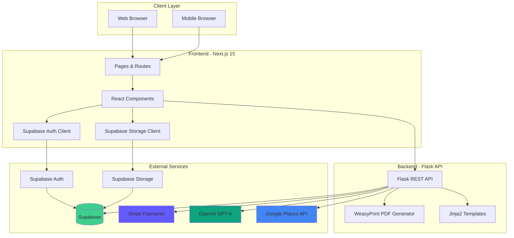

## Data Flow Architecture

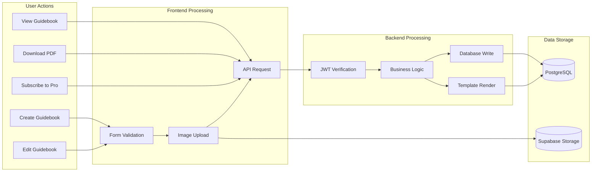

## Database Schema

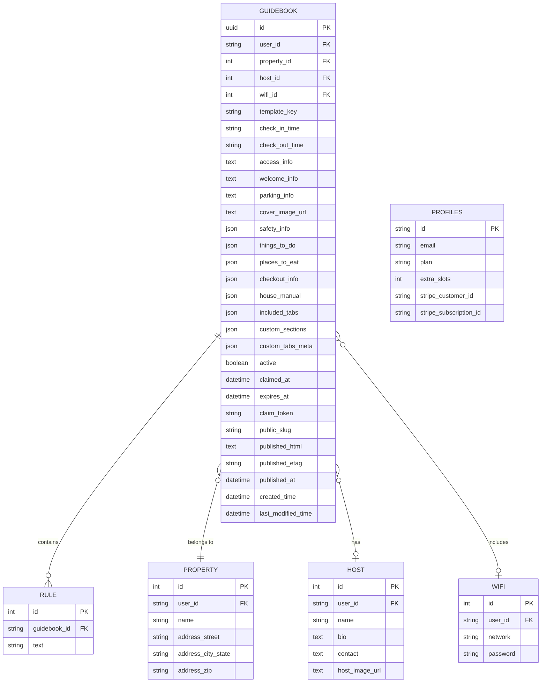

## Authentication Flow

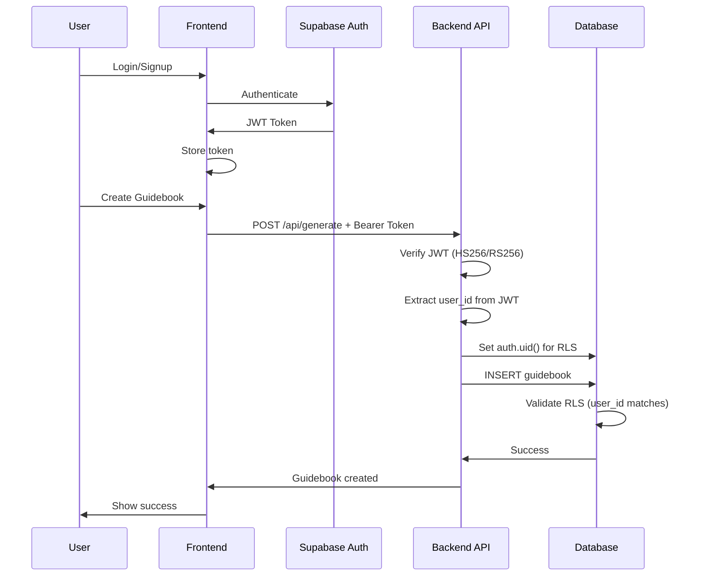

## Subscription & Billing Flow

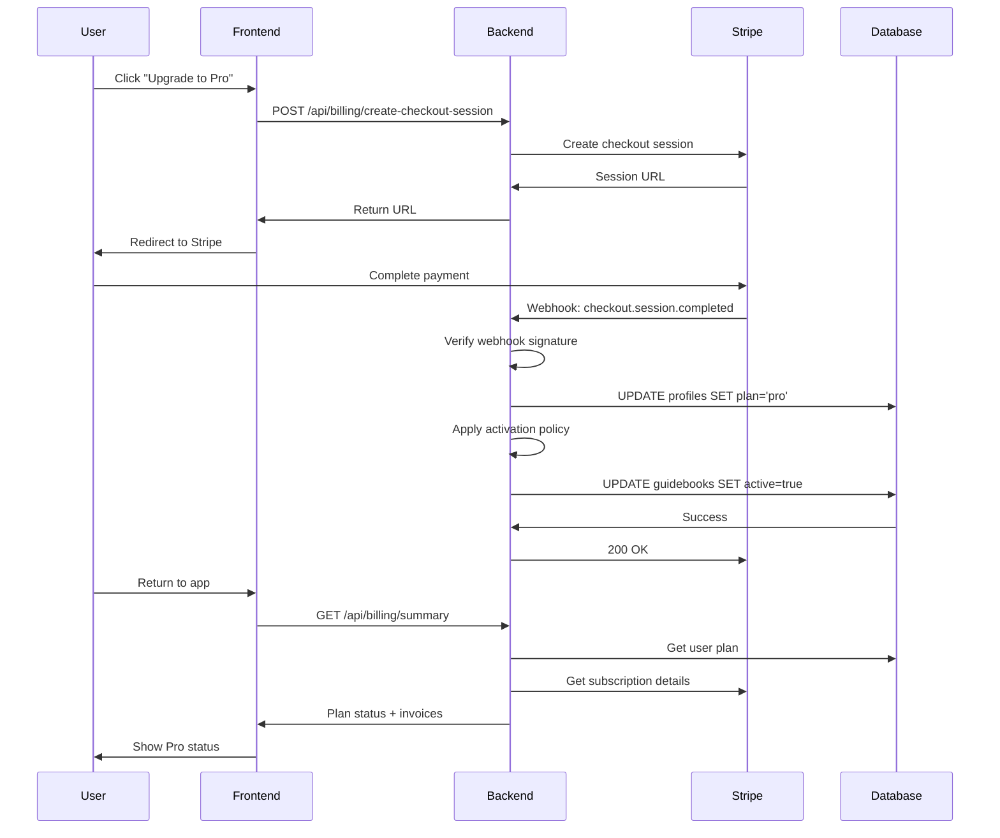

## PDF Generation Flow

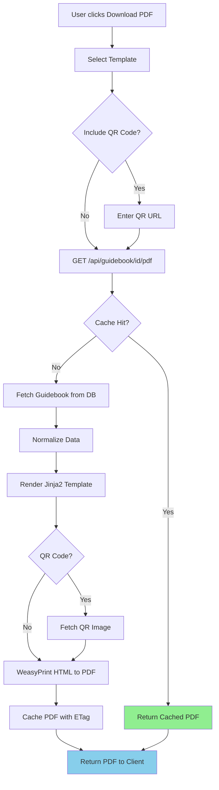

## AI Recommendation Flow

```mermaid
graph LR
    A[User enters location] --> B[Click AI Generate]
    B --> C{Food or Activities?}

    C -->|Food| D[POST /api/ai-food]
    C -->|Activities| E[POST /api/ai-activities]

    D --> F[OpenAI GPT-4]
    E --> G[OpenAI GPT-4o]

    F --> H[Generate 5 restaurants]
    G --> I[Generate 5 activities]

    H --> J[For each recommendation]
    I --> J

    J --> K[Google Places Text Search]
    K --> L{Found?}
    L -->|Yes| M[Get Place Details]
    L -->|No| N[Skip item]

    M --> O[Extract photo_reference]
    O --> P[Return enriched data]
    N --> P

    P --> Q[Frontend displays results]
    Q --> R[User clicks photo]
    R --> S[GET /api/place-photo]
    S --> T[Fetch from Google with API key]
    T --> U[Return image with CORS headers]

    style F fill:#10a37f
    style G fill:#10a37f
    style K fill:#4285f4
    style M fill:#4285f4
```

## Frontend Component Hierarchy

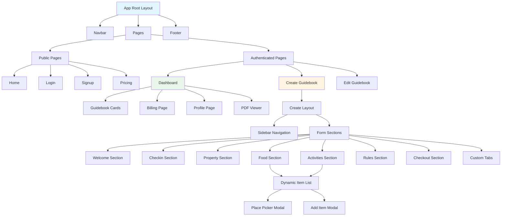

## API Endpoint Map

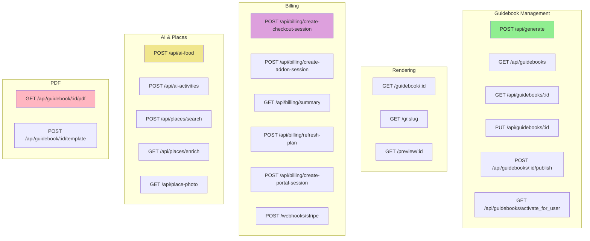

## Deployment Architecture

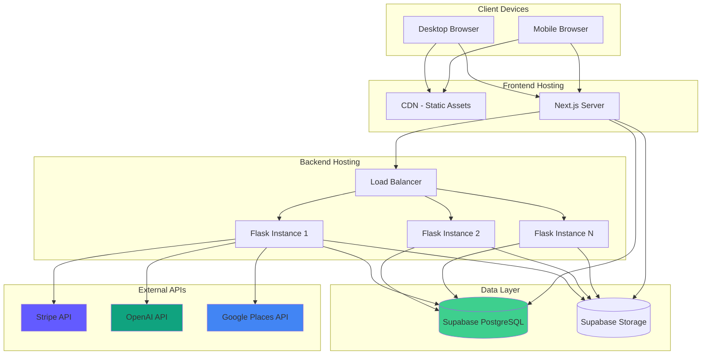

## Security Architecture

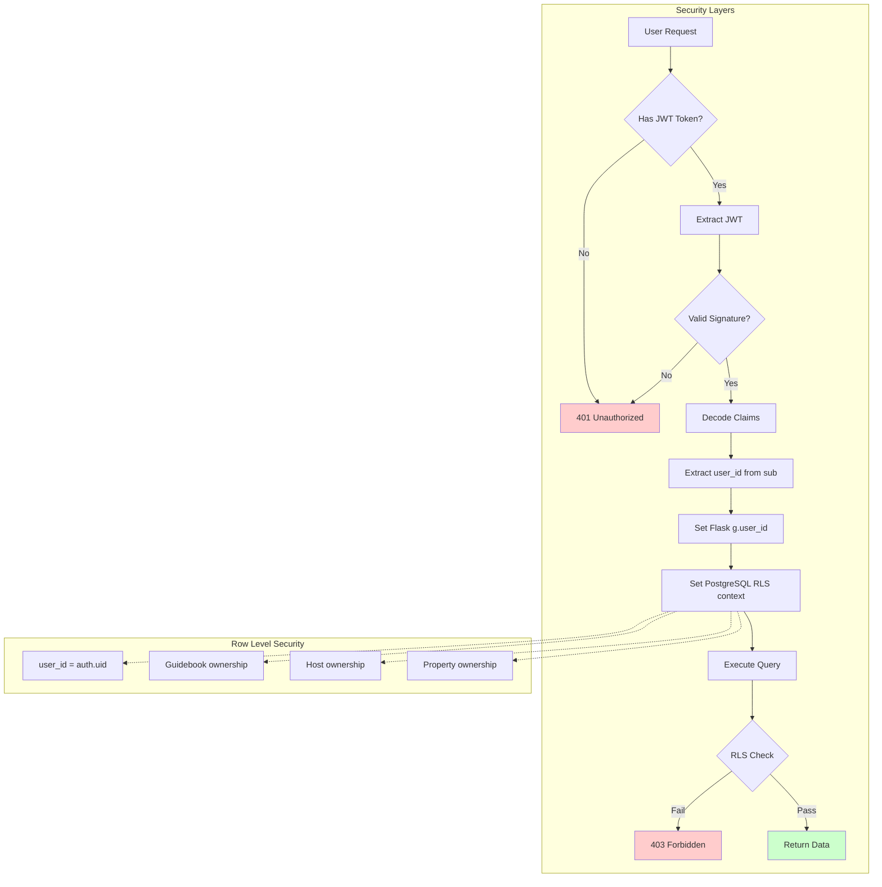

## Caching Strategy

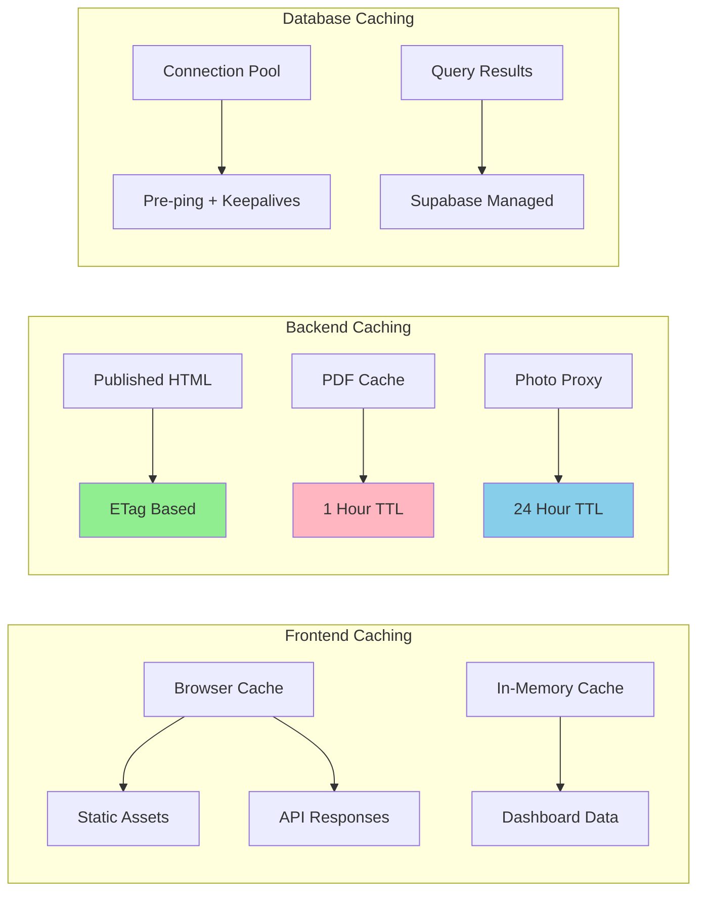

---

## Technology Stack Summary

| Layer | Technology | Purpose |
|-------|-----------|---------|
| **Frontend** | Next.js 15 + React 19 | SSR/SSG web framework |
| **Styling** | Tailwind CSS 4 | Utility-first CSS |
| **UI Components** | Radix UI | Accessible primitives |
| **Backend** | Flask 3.0 | REST API server |
| **Database** | PostgreSQL (Supabase) | Relational data storage |
| **ORM** | SQLAlchemy 3.0 | Database abstraction |
| **Authentication** | Supabase Auth | JWT-based auth |
| **Storage** | Supabase Storage | Object storage for images |
| **Payments** | Stripe | Subscription management |
| **PDF** | WeasyPrint 66 | HTML to PDF rendering |
| **AI** | OpenAI GPT-4/4o | Content recommendations |
| **Maps** | Google Places API | Location data enrichment |
| **Server** | Gunicorn | WSGI HTTP server |

---

## Key Architectural Decisions

1. **Supabase for Auth & Database**: Reduces infrastructure complexity, provides RLS
2. **Serverless-Ready Design**: Stateless backend, external storage
3. **JWT-Based Auth**: Scalable, no session storage needed
4. **JSON Columns**: Flexible schema for evolving features
5. **ETag Caching**: Performance optimization for public guidebooks
6. **CORS Proxy**: Solves third-party API CORS issues
7. **On-Demand PDF**: No storage overhead, always fresh
8. **Webhook-Driven Billing**: Eventual consistency, reliable state sync
9. **Row-Level Security**: Defense in depth for multi-tenancy
10. **Template System**: Reusable rendering for web and PDF

